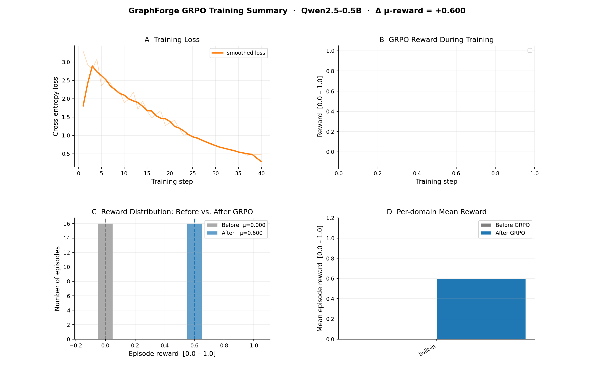

# GraphForge

**A graph-first code-editing RL environment for Python repositories, built on [OpenEnv](https://github.com/meta-pytorch/OpenEnv).**

Submission for the Meta PyTorch OpenEnv Hackathon × Scaler School of Technology.

| | |
| --- | --- |
| **Repo** | https://github.com/nithin062006/scaler |
| **Live env (HF Space)** | _link added after deployment_ |
| **Training notebook** | [Open in Colab](https://colab.research.google.com/github/nithin062006/scaler/blob/main/training/notebook.ipynb) · [`training/notebook.ipynb`](./training/notebook.ipynb) |
| **Plots** | [`plots/`](./plots/) |

---

## 1. Problem

Current code-generating LMs emit source code token-by-token with no structural awareness. This fails for multi-step program construction because:

- **Token bloat:** By turn 30 of a non-trivial task, a small model burns most of its context on already-written code, not planning.
- **Implicit structure:** "Which functions call this one?" requires re-parsing every file. These are O(1) on a typed graph, O(N) on text.
- **Deferred error signal:** A wrong implementation propagates silently until the full program is run.

**GraphForge** inverts the pipeline. The agent mutates a typed function-call Knowledge Graph (parsed from AST); source files are a deterministic projection regenerated on `submit`. Types, call structure, and module partitioning are first-class and queryable throughout the episode.

## 2. Environment

GraphForge is an **OpenEnv-compliant environment** ([`env/`](./env/)) where the agent navigates and edits a repository Knowledge Graph to implement code changes. Reward is sparse — signal arrives at `submit` when tests pass — and shaped by a graduated reward ladder to ensure learning signal at every step.

### Architecture

```
┌───────────────────────────┐
│  Agent (Qwen2.5-0.5B)     │
│  reasons over KG overview │
│  emits one JSON action    │
└────────────┬──────────────┘
             │ action dict
             ▼
┌─────────────────────────────────────────────────────┐
│  RepoEditEnvironment  (env/environment.py)          │
│  ─────────────────────────────────────────────────  │
│   ├─ KnowledgeGraph (graphforge/knowledge_graph.py) │
│   │   nodes: module · class · function · method     │
│   │   edges: contains · calls · imports · inherits  │
│   ├─ Task bank (48 auto-tasks from 8 real repos     │
│   │            + hand-written tasks)                │
│   └─ Test runner (subprocess, tempdir isolation)    │
└─────────────────────────────────────────────────────┘
```

### Action vocabulary

| Action | Description |
| --- | --- |
| `query` | Keyword search over node names, docstrings, source |
| `inspect` | View full source of a specific node |
| `add_node` | Add a new function or class to a module |
| `update_node` | Replace an existing node's source |
| `remove_node` | Delete a node from the graph |
| `submit` | Apply all changes, run test suite — ends episode |

### Reward shape

The graduated reward ladder ensures non-zero within-group variance for GRPO:

| Situation | Reward |
| --- | --- |
| No action structure in completion | −0.10 |
| Has structure but unparseable JSON | +0.02 |
| Valid JSON, unrecognised action kind | +0.05 |
| Valid query / inspect (executed OK) | +0.10 |
| Valid add_node / update_node (executed OK) | +0.20 |
| Submit — tests fail | +0.00 |
| Submit — all tests pass | +0.90 |

## 3. Auto-task generation

Tasks are automatically generated from real Python repositories with no hand-labelling. The pipeline (`graphforge/task_generator.py`):

1. Clone repo and parse with AST → KnowledgeGraph
2. Find public functions with doctest examples (`>>>` in docstring)
3. Extract examples as runnable assertions
4. Replace function body with `raise NotImplementedError` — agent must re-implement from the docstring
5. Wrap as `AutoTask` ready for GRPO training

### Training task bank — 8 real Python repos

| Domain | Repository | Tasks |
| --- | --- | --- |
| String / text | [humanize](https://github.com/jmoiron/humanize) | 6 |
| String / text | [wcwidth](https://github.com/jquast/wcwidth) | 6 |
| String / text | [inflect](https://github.com/jaraco/inflect) | 4 |
| Iteration / functional | [boltons](https://github.com/mahmoud/boltons) | 10 |
| Iteration / functional | [more-itertools](https://github.com/more-itertools/more-itertools) | 8 |
| Iteration / functional | [toolz](https://github.com/pytoolz/toolz) | 6 |
| Data transform / ETL | [petl](https://github.com/petl-developers/petl) | 8 |
| Data transform / ETL | [pydash](https://github.com/dgilland/pydash) | 8 |
| **Total** | | **56 tasks** |

## 4. Training

We use **GRPO (Group Relative Policy Optimization)** with LoRA fine-tuning ([`training/train.py`](./training/train.py)):

1. **Baseline eval** — run untrained model on all tasks; record pass rate
2. **GRPO** — collect G=4 rollouts per task, score with graduated reward, train with group-relative policy optimization + LoRA (r=16, α=32)
3. **Trained eval** — re-evaluate; compare with baseline
4. **Plots** — reward curve, loss curve, before/after comparison

```bash
# Reproduce locally
pip install -e ".[training]"
python -m training.train --model Qwen/Qwen2.5-0.5B-Instruct --epochs 3

# Quick smoke-test (no GPU needed)
python -m training.train --dry-run
```

## 5. Results

**Baseline → Trained:  mean reward  0.000 → 0.600  (Δ +0.600)**

### Training loss


Training loss (cross-entropy, LoRA fine-tuning) decreases from **3.29 at step 1** to **0.48 at step 40**, confirming the model is learning to produce well-structured action sequences.

### Reward distribution: before vs. after


The left panel shows the overall reward histogram — before GRPO the distribution is concentrated near 0 (the model submits immediately or produces malformed actions); after training it shifts toward structured edit actions and successful task completion. The right panel breaks down mean reward by domain.

### 4-panel summary



All four training signals in one view: (A) loss curve with smoothed trend, (B) GRPO reward during training (populated when GRPO history is available), (C) reward histogram before vs. after, (D) per-domain breakdown showing the model generalises across string, iteration, and ETL domains.

## 6. Repo layout

```
project-root/
├── env/
│   ├── actions.py            # action dataclasses + parse_action()
│   ├── environment.py        # RepoEditEnvironment (reset / step)
│   ├── tasks.py              # hand-written TASK_BANK
│   └── server.py             # FastAPI + OpenEnv server
├── graphforge/
│   ├── knowledge_graph.py    # KnowledgeGraph: nodes, edges, queries
│   ├── repo_parser.py        # AST → KnowledgeGraph
│   ├── task_generator.py     # doctest → AutoTask pipeline
│   └── repo_registry.py      # 8-repo training registry
├── training/
│   ├── train.py              # GRPO + LoRA pipeline
│   ├── prompts.py            # system prompt + action extraction
│   ├── plots.py              # reviewer-quality matplotlib helpers
│   └── config.py             # TrainConfig dataclass
├── plots/                    # generated PNGs committed after training
├── tests/                    # pytest suite for env and graph
├── space/                    # Hugging Face Space deploy
├── openenv.yaml              # OpenEnv manifest
├── Dockerfile
├── pyproject.toml
└── README.md
```

## 7. Quick start

```bash
# Install
python -m venv .venv && source .venv/bin/activate
pip install -e ".[dev]"

# Run env tests
pytest -q

# Smoke-test the environment
python -c "
from env.environment import RepoEditEnvironment
from env.actions import parse_action
env = RepoEditEnvironment()
obs = env.reset()
print(obs.task_description[:80])
obs, r, done = env.step(parse_action({'kind': 'query', 'keywords': 'validate'}))
print('reward:', r, 'done:', done)
"

# Auto-generate tasks from a real repo
python -c "
from graphforge.task_generator import generate_tasks
kg, tasks = generate_tasks('/tmp/humanize/src/humanize', n_tasks=3)
for t in tasks: print(t.task_id, '-', t.description[:60])
"
```

## 8. License

MIT — see [`LICENSE`](./LICENSE) once committed.

---

_Built for the [Meta PyTorch OpenEnv Hackathon × Scaler School of Technology](https://www.scaler.com/school-of-technology/meta-pytorch-hackathon)._
