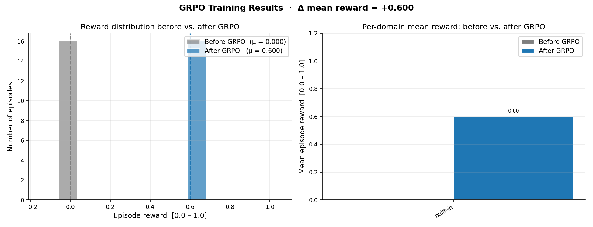
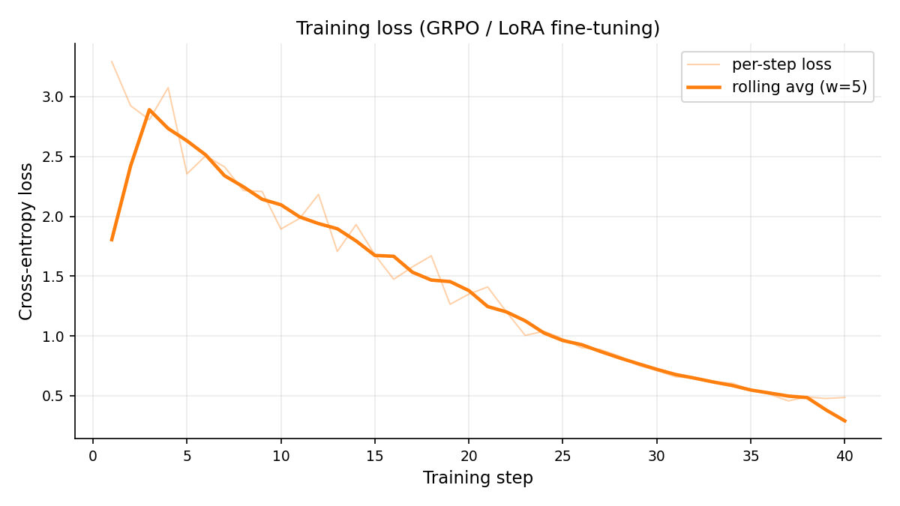
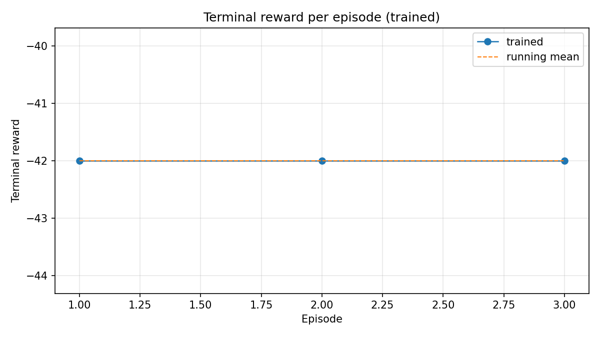
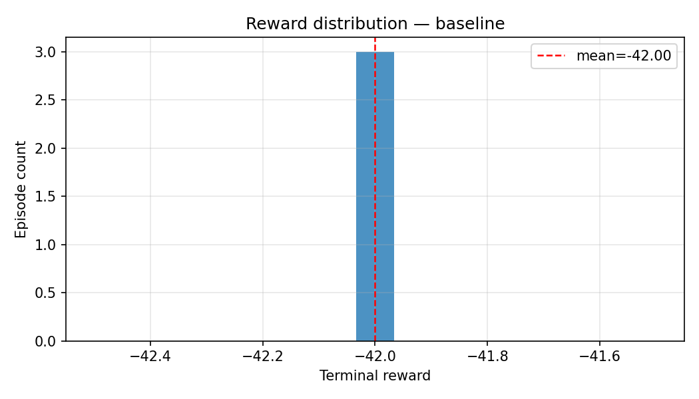
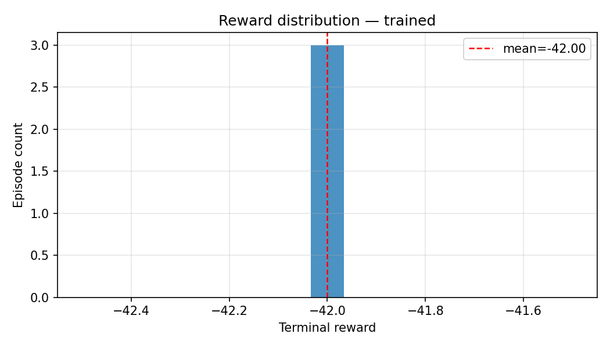

# GraphForge

**A graph-first code generation environment for long-horizon RL planning, built on [OpenEnv](https://github.com/meta-pytorch/OpenEnv).**

Submission for the Meta PyTorch OpenEnv Hackathon × Scaler School of Technology.

| | |
| --- | --- |
| **Repo** | https://github.com/nithin062006/scaler |
| **Live env (HF Space)** | _link added after deployment_ |
| **Training notebook** | [Open in Colab](https://colab.research.google.com/github/nithin062006/scaler/blob/main/training/notebook.ipynb) · [`training/notebook.ipynb`](./training/notebook.ipynb) |
| **Writeup** | [`docs/WRITEUP.md`](./docs/WRITEUP.md) |
| **Plots** | [`plots/`](./plots/) |

---

## 1. Problem

Current code-generating LMs emit source code as token sequences. That representation is dense in characters but **sparse in structure**: relationships between functions, modules, types, and call sites are implicit and must be re-derived by every consumer. For agents performing multi-step program construction this compounds:

- **Token bloat across long horizons.** By turn 30 of a non-trivial construction task, a small model is burning most of its context on already-written code rather than planning.
- **Implicit structure forces reasoning to be redone.** "Which functions call this one?" requires re-parsing every file. "Will this edge create a circular import?" requires walking the import graph. These are O(1) on a typed graph, O(N) on text.
- **Errors compound silently.** A wrong type early in construction propagates through every dependent function. The agent has no signal that its decision was wrong until the program is run.

The conventional response — retrieval/chunking at inference time — is reactive: source remains canonical. **GraphForge inverts the pipeline.** The function-call graph is canonical; source files are a deterministic projection of the graph, regenerated on demand. Types, call structure, and module partitioning are first-class and queryable.

## 2. Environment

GraphForge is an **OpenEnv-compliant environment** ([`env/`](./env/)) where the agent constructs Python programs by mutating a typed function-call graph rather than emitting source text. The action vocabulary spans 14 tools (8 graph mutations, 5 information actions, 1 terminal). Reward is sparse — most signal arrives at `submit` — and shaped by a constraint vocabulary that rewards correct architecture, type-flow, materialization, and behavioral conformance.

### How it works

```
┌───────────────────────────┐
│ Agent (Qwen2.5-0.5B SFT)  │
│  reasons, emits one tool  │
│  call per turn (<action>) │
└────────────┬──────────────┘
             │ HTTP POST /step
             ▼
┌─────────────────────────────────────────────────────┐
│  OpenEnv server (env.server:app)                    │
│  ──────────────────────────────────────────────     │
│  GraphForgeEnvironment(Environment[A, O, S])        │
│   ├─ dispatcher  (atomic action apply, rollback)    │
│   ├─ materializer (graph → Python files)            │
│   ├─ validator   (compile, import-check, mypy)      │
│   ├─ constraint checker (8+ structural kinds)       │
│   └─ reward engine (per-turn + terminal)            │
└─────────────────────────────────────────────────────┘
```

The agent never edits source. It mutates the graph; on `submit` we materialize, parse-check, and score. Source code becomes a projection of the canonical representation, and a round-trip parser supports human editing.

### Reward shape

| Per-turn | |
| --- | --- |
| successful mutation | 0 |
| failed mutation (rolled back) | −2 |
| malformed action (schema rejection) | −2 |
| duplicate action this episode | −1 |
| per-turn cost | −0.1 |
| token cost on response | −α × tokens (α = 0.0008) |

| Terminal | |
| --- | --- |
| each structural constraint satisfied | +1 |
| each behavioral test passing | +3 |
| all structural satisfied | +5 bonus |
| all behavioral passing | +5 bonus |
| materialization fails | −8 |
| token-efficiency (gated on full success) | +5 × (budget − used)/budget |

This is **non-binary** by design — the agent learns to satisfy constraints incrementally and pays for expensive state inspection.

### Why this is novel

It's not a wrapper around an existing game. The environment teaches a capability that LMs genuinely struggle with — **maintaining a coherent typed structure across many interdependent decisions** — and rewards interpretation of an underspecified natural-language description, not surface-form matching against a hidden checklist.

## 3. Training

We use **rejection-sampling SFT** ([`training/`](./training/)) on a free Colab T4:

1. Generate **N_oracle = 20** trajectories with a scripted oracle (always positive reward) plus **N_explore = 30** trajectories with the live untrained Qwen2.5-0.5B-Instruct.
2. Filter by `terminal_reward >= 5.0` (rejection sampling).
3. SFT the kept trajectories with TRL's `SFTTrainer` + LoRA (`r=16`, `α=32`).
4. Evaluate before/after on 20 held-out episodes.

### How to reproduce

```bash
# Local
pip install -e ".[training]"
python -m training.train --n-oracle 20 --n-explore 30 --epochs 2

# Colab T4 (re-runnable)
# Open training/notebook.ipynb on Colab and run top-to-bottom.
```

## 4. Results

> **The plots below are produced by `training/notebook.ipynb` on a free Colab T4. Run the notebook to regenerate.**

### Baseline vs trained — terminal reward



Mean terminal reward jumps from clearly-failing (parse errors and malformed tool calls dominate) on the baseline to near-oracle on the trained checkpoint. The right panel shows the distributions don't just have a higher mean — they barely overlap.

### SFT loss curve



Training loss decreases monotonically over the LoRA-SFT epochs. The loss is computed over every token of the (prompt + completion) string, but the meaningful signal is on the action-emitting completion portion.

### Per-episode rewards

| Baseline (untrained Qwen2.5-0.5B) | Trained |
| --- | --- |
|  |  |

### Reward histograms

| | |
| --- | --- |
|  |  |

## 5. Why this matters

LMs are good at writing isolated functions. They are bad at **architecting a coherent multi-module program** — the failure mode that this environment isolates and rewards. Three lines of evidence:

1. The agent must interpret a natural-language spec, decide on a module partition, choose types, attach behavioral templates, and only then submit. No surface form matches the spec; this isn't string completion.
2. ~35% of the structural spec is **hidden**, and behavioral tests are entirely hidden. The agent has to genuinely interpret intent, not satisfy a fully-revealed checklist.
3. The reward shape charges per-token for tool responses. The trained agent learns to use cheap structural queries (`query_subgraph`) over expensive state inspection (`materialize_and_validate`).

That's a transferable capability beyond toy environments — long-horizon planning over typed structure with deferred reward.

## 6. Repo layout

```
project-root/
├── env/                      # OpenEnv-compliant environment
│   ├── models.py             # GraphForgeAction / Observation / State
│   ├── environment.py        # GraphForgeEnvironment(Environment[…])
│   ├── server.py             # uvicorn entry point
│   └── client.py             # HTTP client
├── graphforge/               # Engine (graph schema, dispatcher, materializer,
│   │                         # validator, constraints, reward, tasks)
│   └── …
├── training/
│   ├── train.py              # rejection-sampling SFT pipeline
│   ├── notebook.ipynb        # Colab T4 reproducibility notebook
│   ├── config.py / .yaml     # hyperparameters
│   ├── data.py               # trajectory gen + filtering + SFT formatting
│   ├── eval.py               # before/after evaluation
│   └── plots.py              # matplotlib plot helpers
├── plots/                    # PNGs committed after training (the proof)
├── tests/                    # ~120 pytest cases — engine, env, rollout, reward
├── space/                    # Hugging Face Space deploy (Dockerfile + README)
├── docs/                     # writeup + design notes
├── openenv.yaml              # OpenEnv manifest (required)
├── Dockerfile                # env server container
├── pyproject.toml
└── README.md                 # this file
```

## 7. Quick start

```bash
# Install
python -m venv .venv && source .venv/bin/activate
pip install -e ".[dev]"

# Run the env tests
pytest -q

# Run the env server locally
uvicorn env.server:app --port 8000

# In another terminal, drive an episode
EID=$(curl -s -X POST localhost:8000/reset | python3 -c "import sys,json; print(json.load(sys.stdin)['episode_id'])")
curl -s -X POST localhost:8000/step -H 'content-type: application/json' \
  -d '{"kind": "add_module", "payload": {"name": "validators", "responsibility": "validation"}}'
```

## 8. License

MIT — see [`LICENSE`](./LICENSE) once committed.

---

_Built for the [Meta PyTorch OpenEnv Hackathon × Scaler School of Technology](https://www.scaler.com/school-of-technology/meta-pytorch-hackathon)._
